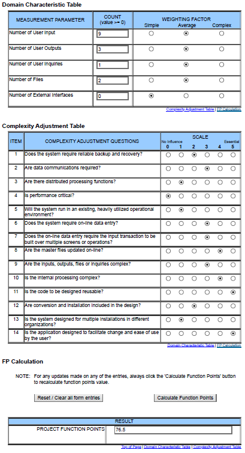

# Use-Case Specification: Gamification | Version 1.2
## 1. Use-Case: Gamification
### 1.1 Brief Description
This use case describes ideas for implementing small game-like gimmicks to make our Flashcard application more interesting and fun.
## 2. Flow of Events
### Activity Diagram
The following activity diagram represents a simplified version of this complex issue. As a rule, it should be expanded at the same time as the implementation begins, since you have a much better overview of the overall functionality during this time.

### 2.1 Basic flow
The user logs in and has the possibility to create a lobby with up to 4 persons via a button "Play online". As soon as this group has been filled, the game can be started ("Start"-button). 
The game itself is about answering the front of the flashcards as quickly and correctly as possible. For each correctly answered question, you get one point. 
At the end, based on the elapsed time and the number of points, a scoreboard is created with statistics (username, points, etc.).
After that, the player is assigned a certain rank, in which he can be promoted or relegated.

At the end of the game the players are transferred back to the lobby. 

## 3. Special Requirements
### 3.1 Owning An Account
In order to create a group for playing, the user has to have an account.

## 4. Preconditions
### 4.1 The user has to be logged in
To ensure proper gaming with group members the user has to be logged in.

## 5. Postconditions
### 5.1 Statistics
It must be possible to assign statistics (learned cards (points) after a certain time) to each player. 

### 5.2 Back to lobby
The user must be transferred back to the lobby with his group members.

### 5.3 Ranking
The rank of the user must have been changed (Uprank or Downrank).

## 6. Function Points

