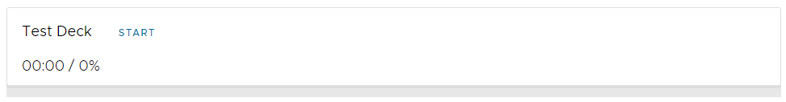
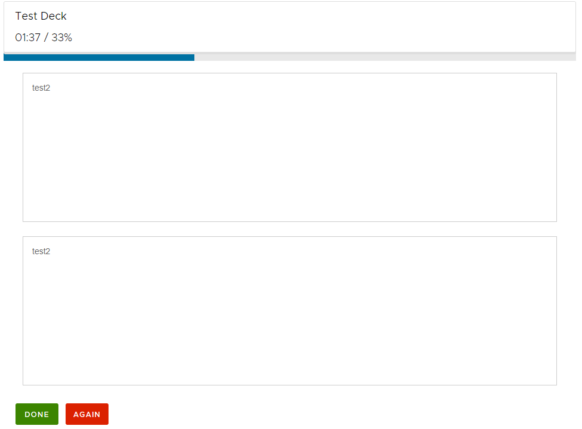

# Use-Case Specification: Learn Flashcards | Version 1.2
## Use-Case Specification: Learn Flashcards

## 1. Use-Case: Learn Flashcards

### 1.1 Brief Description

This use case describes a learning run for created decks with associated flashcards. The learning process should also be indicated in the form of a percentage or progress bar. After completion of the learning process, a conclusion window should be displayed. 

## 2. Flow of Events

### 2.1 Basic flow

In general, based on created decks and flashcards, users should be able to use the "Learn Deck" mode by clicking the button in the deck menu next to the deck name.

### 2.2 Learn Deck Mode  

The user has the possibility to click on the "Start" button in the Learn Flashcards window.

This starts a timer and displays the front of a flashcard of the deck.

 
From here, the user has the option to display the answer (the back of the flashcard) via the "Show Answer" button.
Once the user has successfully learned the card, he can press the "Done" button, which will then increase his learning progress percentage and display the next flashcard to learn.
If the user is not so sure with the result, the "Again" button can be pressed and the card will be asked again later. However, the progress then does not increase.

## 3. Special Requirements

### 3.1 Owning An Account
        
In order to learn a deck the user has to have an account.

## 4. Preconditions

### 4.1 The user has to be logged in

The user must be logged in when working with decks.

### 4.2 Decks should be available

The user should have already created a deck with (>= 1) flashcards.

## 5. Postconditions

### 5.1 Completion page

The user should be shown a completion page after completing the mode (100%).

## 6. Function Points

