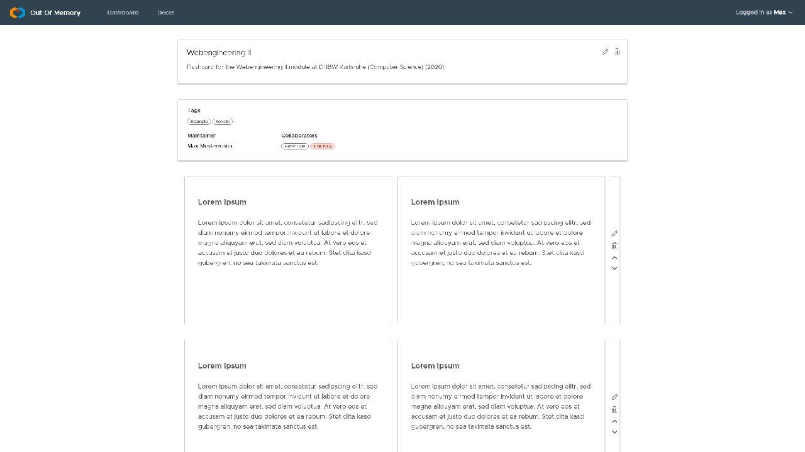

# out-of-memory
## Use-Case Specification: Deck management

## 1. Use-Case: Manage decks

### 1.1 Brief Description

This use case describes the creation, reading, updating and deleting of decks for flashcards (CRUD).

## 2. Flow of Events

### 2.1 Basic flow

In general a user will be able to create decks and list all of the created decks. Furthermore the user might want to edit or delete decks afterwards.

### 2.2 Creation  

For creating a new deck the user will be asked to enter a title, a description and tags for the new deck. Furthermore the user can set the maintainer of the deck as well as collaborators and the visibility for other users.

### 2.3 View

The user can view a specific deck to see all relevant information about it and continue with further actions like editing or deleting the selected deck.

### 2.4 Edit

The edit page is the same as the page to create a new deck. Meaning the user can change all the data he set at creation.

### 2.5 List

The user wants to be able to view all of his decks in order to be able to select one and get more information about it. Therefore he is presented a list with all entries.

### 2.6 Delete

Of course the user wants to be able to delete decks. Therefore we added a button in the view and the edit page to delete an entry. To ensure he does not delete a deck on accident we added a modal asking if he really wants to do this.

## 3. Special Requirements

### 3.1 Owning An Account
        
In order to create a new deck or interact with decks at all the user has to have an account.

## 4. Preconditions

### 4.1 The user has to be logged in

The user must be logged in when working with decks.

## 5. Postconditions

### 5.1 Create

After creating the new deck, the user will be redirected to the list overview, where the new entry will already be displayed

### 5.2 Edit

After the user saved his edits, the updated data will be displayed in the view page of the deck overview.

### 5.3 Delete

After confirming the deletion modal, the deck will be permanently removed and no longer displayed in the list overview.

## 6. Function Points
