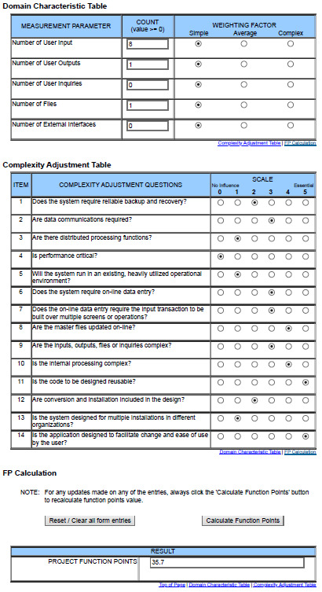

# Use-Case Specification: Manage Flashcards | Version 1.2
## 1. Use-Case: Manage Flashcards
### 1.1 Brief Description
This use case describes the creation, reading, updating and deleting of flashcards (CRUD).

## 2. Flow of Events
### Activity Diagram

### 2.1 Basic flow
In general a user will create a flashcard and list all of his journals. He will maybe edit it later and from time to time he will delete journals.

### 2.2 Creation
The creation of a new Flashcard. The user will be asked to enter a question, and 4 answers where only one is correct.

### 2.3 Edit
During editing the user can modify the question and the answers of the flashcard.

### 2.4 View
The user wants to be able to view all of his flashcards. Therefore he is presented a list with all flashcards.

### 2.5 Delete
Of course the user wants to be able to delete flashcards. Therefore we added a button in the edit page to delete an entry. To ensure he does not delete a flashcard on accident we added a modal asking if he really wants to do this.

## 3. Special Requirements
### 3.1 Owning An Account
In order to create a new flashcard the user has to have an account. Only if he has one, the dialog of a creation of a flashcard will be visible.

## 4. Preconditions
### 4.1 The user has to be logged in
To ensure proper privacy of flashcards the user has to be logged in when working with flashcards.

## 5. Postconditions
### 5.1 Create
After creating the new flashcard the user will be redirected to the list overview, where the new entry will already be displayed

### 5.2 Edit
After the user saved his edits, the updated data will be displayed in the list overview.

### 5.3 Delete
After confirming the deletion modal, the flashcard will be permanently removed and no longer displayed in the list overview.

## 6. Function Points

## 7. Feature File
[Feature File](../../../cucumber/src/test/resources/features/manageFlashcard.feature)
