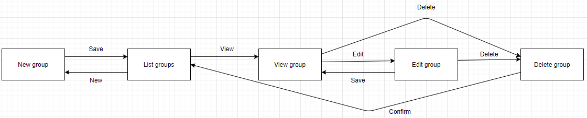
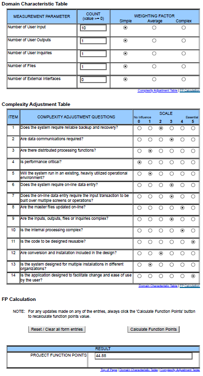

# Use-Case Specification: Manage Groups | Version 1.2
## 1. Use-Case: Manage Groups
### 1.1 Brief Description
This use case describes the creation, reading, updating and deletion of groups (CRUD).

## 2. Flow of Events
### Activity Diagram

### 2.1 Basic flow
In general a user will create a group and list all of his groups. He will maybe edit it later and from time to time he will delete groups.

### 2.2 Creation
The creation of a new group. The user will be asked to enter a group name, maintainer and group members.

### 2.3 Edit
During editing the user can modify the group name and the members of the group.

### 2.4 View
The user wants to be able to view all of his groups. Therefore he is presented a list with all groups.

### 2.5 Delete
Of course the user wants to be able to delete groups. Therefore we will add a button in the edit page to delete an group. To ensure he does not delete a group on accident we added a modal asking if he really wants to do this.

## 3. Special Requirements
### 3.1 Owning An Account
In order to create a new group the user has to have an account. Only if he has one, the dialog of a creation of a group will be visible.

## 4. Preconditions
### 4.1 The user has to be logged in
To ensure proper privacy of flashcards the user has to be logged in when working with groups.

### 4.2 Group members should be existent
If the user wants to add group members, these members must actually exist in the system (ergo: have an account).

## 5. Postconditions
### 5.1 Create
After creating the new group the user will be redirected to the list overview, where the new entry will already be displayed.

### 5.2 Edit
After the user saved his edits, the updated data will be displayed in the list overview.

### 5.3 Delete
After confirming the deletion modal, the group will be permanently removed and no longer displayed in the list overview.
Also, after deletion, each member gets a message that their group has been disbanded.

## 6. Function Points

