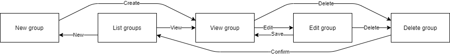

# out-of-memory
## Use-Case Specification: Group management

## 1. Use-Case: Manage groups

### 1.1 Brief Description

This use case describes the creation, reading, updating and deleting of groups (CRUD).

## 2. Flow of Events

### 2.1 Basic flow

In general a user will be able to create groups and list all of the created groups. Furthermore the user might want to edit or delete his groups afterwards.

### 2.2 Creation  

For creating a new group the user will be asked to enter a title, a description and tags for the new group. Furthermore the user can add users to the group and set the admins and the visibility for other users. 

[tbd]

### 2.3 View

The user can view a specific group to see all relevant information about it and continue with further actions like editing or deleting the selected group.

[tbd]

### 2.4 Edit

The edit page is the same as the page to create a new group. Meaning the user can change all the data he set at creation.

[tbd]

### 2.5 List

The user wants to be able to view all of his groups in order to be able to select one and get more information about it. Therefore he is presented a list with all of his entries.

[tbd]

### 2.6 Delete

Of course the user wants to be able to delete groups. Therefore we added a button in the view and the edit page to delete an entry. To ensure he does not delete a group on accident we added a modal asking if he really wants to do this.

[tbd]

## 3. Special Requirements

### 3.1 Owning An Account
        
In order to create a new group or interact with groups at all the user has to have an account.

## 4. Preconditions

### 4.1 The user has to be logged in

The user must be logged in when working with groups.

## 5. Postconditions

### 5.1 Create

After creating the new group, the user will be redirected to the view page of the created group.

### 5.2 Edit

After the user saved his edits, the updated data will be displayed in the view page of the group.

### 5.3 Delete

After confirming the deletion modal, the group will be permanently removed and no longer displayed in the list overview.

## 6. Function Points
