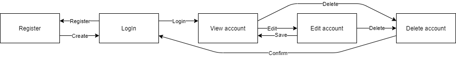

# out-of-memory
## Use-Case Specification: Account management

## 1. Use-Case: Manage accounts

### 1.1 Brief Description

This use case describes the creation, reading, updating and deleting of accounts (CRUD). As well as the login with an existing account.

## 2. Flow of Events

### 2.1 Basic flow

In general a user will be asked to login. If the user does not have an account yet he will be able to create one. With this account the user can now login and edit, view and delete his account.

### 2.2 Register  

For creating an account the user will be asked to enter a username, an email, his full name and a password. Then the user will be asked to login.

[tbd]

### 2.3 LogIn

The user has to enter his username or email and the correct password in order to continue.

[tbd]

### 2.4 View

The user can view his account after login and look at all the relevant data as well as continue with further actions like editing or deleting his account.

[tbd]

### 2.5 Edit

On the edit page the user can change all his account information.

[tbd]

### 2.6 Delete

Of course the user wants to be able to delete his account. Therefore we added a button in the view and the edit page to delete the users account. To ensure he does not delete his account on accident we added a modal asking if he really wants to do this.

[tbd]

## 3. Special Requirements

No special requirements for creating an account. Whereas for login a account has to be created.

## 4. Preconditions

### 4.1 The user has to be logged in

The user must be logged in when working with his account but not for login or register.

## 5. Postconditions

### 5.1 Create

After creating the new account, the user will be redirected to the login page.

### 5.2 Edit

After the user saved his edits, the updated data will be displayed in the view page of the account.

### 5.3 Delete

After confirming the deletion modal, the account will be permanently removed and the user will be logged out and will not be able to login again.

## 6. Function Points
