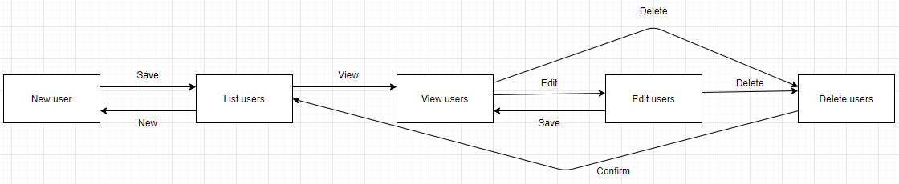
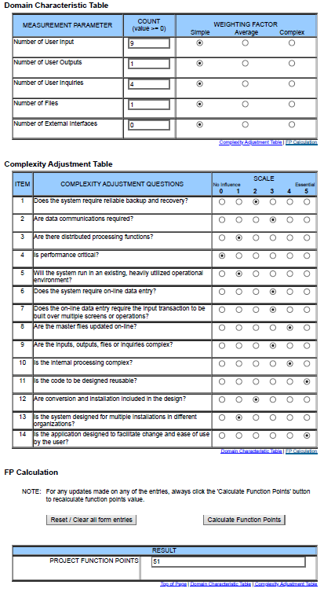

# Use-Case Specification: Manage Users | Version 1.2
## 1. Use-Case: Manage Users
### 1.1 Brief Description
This use case describes the creation, reading, updating and deletion of users (CRUD).

## 2. Flow of Events
### Activity Diagram

### 2.1 Basic flow
In general a user with the admin-role will create a user and list all existent users. He will be able to edit and delete every attribute of an user.
He'll also be able to delete the user himself.

### 2.2 Creation
Normally, a user can register himself through the registration page. Then the user is registered in the system and can be managed by the administrator.
However, the administrator also has the option to create a user. In this case, he must provide all relevant data (username, last name, first name, etc.).

### 2.3 Edit
During editing the administrator can modify the username, password and the other attributes of an user.

### 2.4 View
The administrator wants to be able to view all users. Therefore he is presented a list with all users.

### 2.5 Delete
Of course the administrator wants to be able to delete users. Therefore we'll add a button in the edit page to delete an user. To ensure he does not delete a user on accident we'll add a modal asking if he really wants to do this.

## 3. Special Requirements
### 3.1 Owning An Account
In order to create a new user the administrator himself has to have an account.

### 3.2 Admin Role
Once the administrator's user account has been assigned the role of administrator, only then is it possible for him to operate the user administration.

## 4. Preconditions
### 4.1 The administrator has to be logged in
To ensure proper privacy of users, the administrator has to be logged in when working with users.

## 5. Postconditions
### 5.1 Create
After creating the new user the administrator will be redirected to the list overview, where the new entry will already be displayed.

### 5.2 Edit
After the administrator saved his edits, the updated data will be displayed in the list overview.

### 5.3 Delete
After confirming the deletion modal, the user will be permanently removed and no longer displayed in the list overview.

## 6. Function Points

